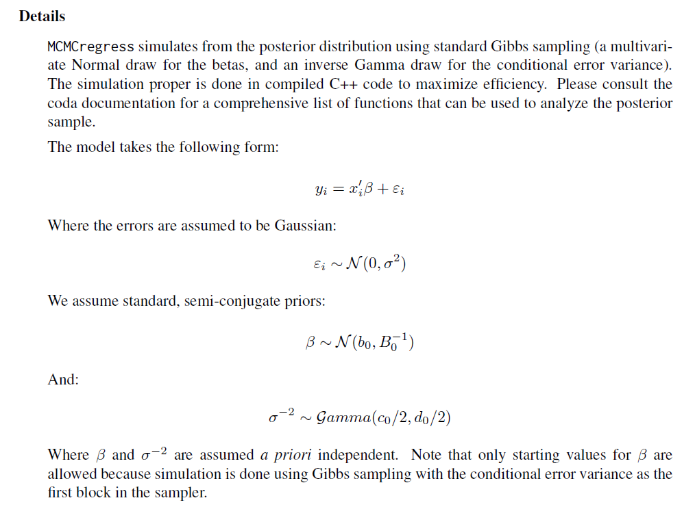
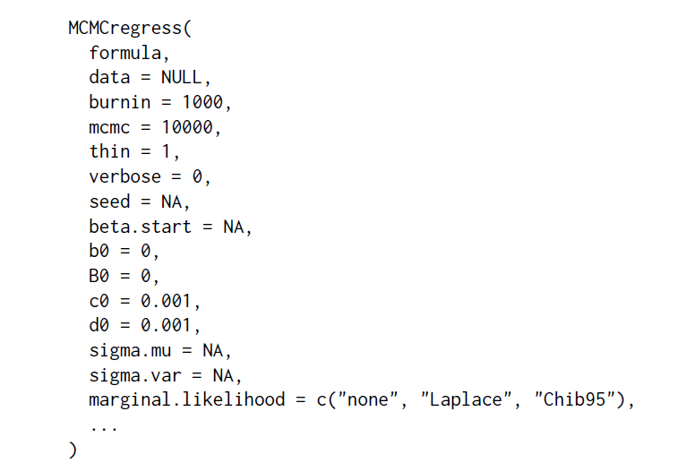
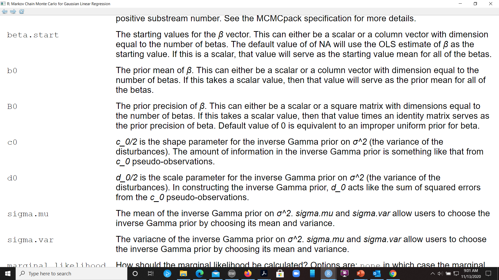

```{r, include = FALSE}
knitr::opts_chunk$set(
  collapse = TRUE,
  fig.width = 6,
  comment = "#>"
)
```

```{r setup}
library(Intro2MLR)
```


# Introduction

The connection between ANOVA (ANalysis Of VAriance) and MLR (Multiple Linear Regression) is a very important part of this course and must be known, mastered and used in all its applications.

The central issue is the F statistic and its interpretation. The chief application is to compare a reduced "R" (nested) model with a larger and more complete "C" model.

$$F = \frac{(SSE_R - SSE_C)/(k-g)}{SSE_C/(n-(k+1))}$$
Or 

$$F = \frac{(SSE_R - SSE_C)/(k-g)}{MSE_{C}}$$

Please note that in terms of projection matrices

$$F = \frac{Y^{'}(P_C - P_R)Y/(k-g)}{Y^{'}(I-P_C)Y/(n-(k+1))}$$

# Completely randomized design

In this experimental design treatments are randomly assigned to experimental units.

## The model 

Since there will be $p$ treatments we have:

$$E(Y)=\beta_0 + \beta_1x_1 + \ldots + \beta_{p-1}x_{p-1}$$
Since we wish to test 

$$H_0: \mu_1 = \ldots =\mu_p$$
The reduced model just includes the intercept $\beta_0$.

So we have $g=0$ and 

$$F=\frac{MS(Model)}{MSE}$$

# The randomized block design

## The model

$$E(Y) = \beta_0 + \beta_1x_1+\ldots + \beta_{p-1}x_{p-1} + \beta_px_p +\ldots + \beta_{p+b-2}x_{p+b-2} $$
where the treatment effects are $\beta_1x_1+\ldots + \beta_{p-1}x_{p-1}$ and the block effects are $\beta_px_p +\ldots + \beta_{p+b-2}x_{p+b-2}$

To investigate the treatments you need a reduced model composed of the block terms.


$$ F = \frac{(SSE_R - SSE_C)/(p-1)}{MSE_C}$$

To investigate the blocks you need a reduced model made of the treatment terms.


$$ F = \frac{(SSE_R - SSE_C)/(b-1)}{MSE_C}$$


# Two factor factorial design

Factor A has a levels, B has  b levels. Main effects for A has a-1 terms, main effects for  B has b-1 terms. Interaction terms: $(a-1)(b-1)$ terms with second order x terms $\{x_1,\ldots ,x_{a-1}\}\times \{ x_{a},\ldots x_{a+b-2}\}$

Note the way the indices populate:

$$E(Y) = \beta_0 + \beta_1x_1 + \cdots + \beta_{a-1}x_{a-1} + \beta_{a}x_{a}+\cdots \beta_{a+b-2}x_{a+b-2} + \beta_{a+b-1}x_{1}x_{a} +\cdots + \beta_{ab-1}x_{a-1}x_{a+b-2}$$

Note that $$n-(k+1) = abr-(ab-1+1)= ab(r-1)$$


This means that the minimum replication size is calculated from:

$$ab(r-1)>0, r\ge 2$$

### Examples frpm s20x case studies


We will use some case studies from package `s20x`

```{r}
library(s20x)
demo(cs41)
```


# Using Bayesian analysis

We will now invoke the Bayesian paradigm to perform some MLR (ANOVA) analyses.

The basic idea here is that of the Bayesian update formula

$$p(\theta|X) \propto p(\theta)f(x|\theta)$$

This formula is saying that the posterior is proportional to the prior times the likelihood. Here $\theta$ is a vector of parameters and $X$ is data of whatever algebraic form is needed.

## Prior

The prior is generally created by summarizing your evidence for the parameter $\theta$ without using the data $X$ at hand.

This will generally be a density expressed in terms of a product of marginals. Each marginal is a prior for the particular parameter component  -- we say the priors are **apriori independent** 

$$p(\theta) = p_1(\theta_1)p_2(\theta_2)\ldots p_r(\theta_r)$$
In the case of a MLR (or ANOVA expressed as an MLR), $\theta = (\beta, \sigma^2)^{'}$


## Low impact priors

These are sometimes incorrectly called **non-informative** priors.

All priors inform the posterior to some degree. If we have little prior knowledge concerning $\theta$ then we should not pretend to have knowledge by using a prior that demonstrates information you do not have.


## MCMCPack from CRAN

This package will enable you to perform MLR analyses from a Bayesian perspective.

The function we will invoke is called `MCMCregress()`

The posterior will be sampled using MCMC (Monte Carlo Markov Chains).


If you do not set priors then default low impact priors will be assigned.

<center>
{ width=90% }

</center>


### Look at the MCMCregress

Note that from the details above that each $\beta$ is given the following prior

$$\beta\sim N(b_0, B_0^{-1})$$

$$\sigma^{-2}\sim Gamma(c_0/2, d_0/2)$$

The parameter $\sigma^{-2}$ is called the precision $\tau$.

$$\tau = \frac{1}{\sigma^2}$$

The prior distributions assigned to the parameters are called priors and the parameters controlling the priors are called **hyper-parameters**


## What are the hyper-parameters set to?

{ width=90% }

### The prior on the precision

In R the density for a Gamma is `f(x)= 1/(s^a Gamma(a)) x^(a-1) e^-(x/s)`.

```{r}
curve(dgamma(x, 
             shape = 0.001/2,
             scale = 0.001/2
             ), 
      xlim = c(0, 1),
      xlab = expression(tau),
      ylab = "Gamma with shape and scale",
      main = "Prior on the precision"
      )
```


### The prior on the betas. 

When $B_0=0$ then each $\beta$ component is given a  uniform density.

This corresponds to a Normal with mean 0 and variance = $+\infty$.

### Documentation on hyper-parameters

{ width=80% }

Notice particularly:

For the prior on $\tau = \sigma^{-2}$ taking the Gamma density:

  1. $c0={\tt Shape \; parameter}$
  2. $d0={\tt scale \; parameter}$

For the prior on $\beta$ taking the Normal density:

  1. $b0={\tt mean\; parameter}$
  2. $B0={\tt precision\; parameter}$


# Example

```{r}
library(s20x)
data(sheep.df)
sheepbayes <-  MCMCpack::MCMCregress(
  formula = Weight~Cobalt,
                                     data = sheep.df,
                                     mcmc = 10000,
                                     burnin = 1000
    
  )

summary(sheepbayes)# Bayesian
summary(sheep.fit2) # Classical
confint(sheep.fit2)
```

## Comparison

The Bayesian intervals for $\beta$ components are comparable with those obtained with the classical method.

But the interpretations are very different.

### Bayes interpretation

Take $\beta_1= \mu_{Cob.Yes}-\mu_{Cob.No}$:

With probability 0.95 the mean weight of sheep that are fed a diet that includes cobalt will have between 0.27 and 4.72kg more weight than sheep fed a diet without cobalt.

### Classical interpretation

Take $\beta_1$ again:

With 95% confidence the mean weight of sheep that fed a diet that includes cobalt  will have between 0.30 and 4.70kg more weight than sheep fed a diet without cobalt.

How could you restate this in a way to make the interval more useful?
Hint: Use ideas of plausibility
