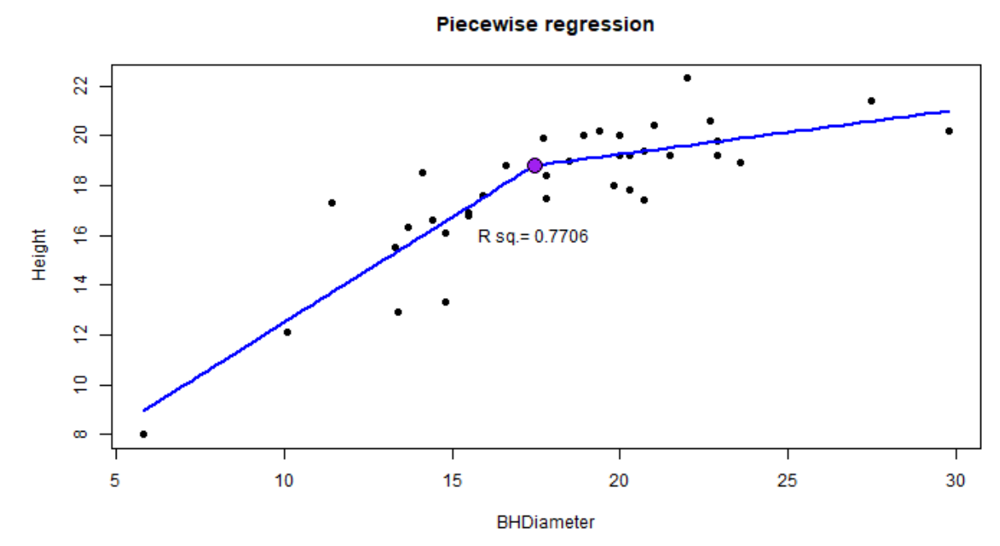

```{r setup, include=FALSE}
knitr::opts_chunk$set(echo = TRUE)
```

# Introduction

Suppose we have two line segments which make a reasonable fit to data, joining at a single point `(x_k,y_k)` which we may call the `change point`. We wish to use data to estimate the lines and some measure of `fit` to determine the `change point`.

# Theory

Suppose that for line 1 and line 2 we have the following formulae


$$l1: y=\beta_0 +\beta_1 x$$
$$l2: y = \beta_0 + \delta +(\beta_1 + \zeta)x$$


{ width=70% }


Then at the change point we have the two lines intersecting

$$\beta_0 +\beta_1x_k = \beta_0+\delta + (\beta_1 +\zeta)x_k$$

Hence we have 

$$\delta=-\zeta x_k$$

Therefore we can write `l2` as

$$y = \beta_0 -\zeta x_k + (\beta_1 +\zeta)x $$
That is 

$$ y = \beta_0 + \beta_1 x + \zeta (x-x_k)$$

`l2` is `l1` with an adjustment term.

We will introduce an indicator function that will be 1 when $x>x_k$ and $0$ else.

So

$$y = \beta_0 + \beta_1 x +\zeta (x-x_k)I(x>x_k)$$


## Generalization

Since the next line segment is the addition of an interaction term we can easily generalize this procedure

Say we have two `change points` and thus three line segments.

Then:

$$ y=\beta_0 + \beta_1 x + \beta_2 (x-x_k)I(x> x_k) + \beta_3 (x-x_{k2})I(x>x_{k2}) $$

## Application

Add two change points to the `Spruce.csv` data set and make a plot of the line segments.
Make $x_k=10$ and $x_{k2}=18$

```{r}
spruce.df = read.csv("SPRUCE.csv")
head(spruce.df)
myf2 = function(x,xk,xk2,coef){
  coef[1]+coef[2]*(x) + coef[3]*(x-xk)*(x-xk>0)+ coef[4]*(x-xk2)*(x-xk2>0)
}

coeff = function(xk,xk2){ # data=spruce.df
  df=within(spruce.df, 
            {
            X<-(BHDiameter-xk)*(BHDiameter>xk) 
            X2<-(BHDiameter-xk2)*(BHDiameter>xk2)
            }
            ) 
  lmp=lm(Height ~ BHDiameter + X + X2, data=df)
  coef(lmp)
}


with(spruce.df,plot(BHDiameter, Height,
                    pch = 21, 
                    cex=1.5,
                    bg="green",
                    main="Height Vs BHDiameter using piecewise regression"
                    ))

cf = coeff(10,18)
curve(myf2(x,10,18,cf), add=TRUE, lwd=2,col="Blue")


```

# Questions to consider (not an assignment)

1. Make a shiny app that will plot points and fit a 3 segment model using changepoints set through widgets

2. Adjust the app so that AIC is displayed (Keep `k=2` as default) `AIC()` is displayed on the upper plot.

3. Find optimal knots -- what criteria would you use?
